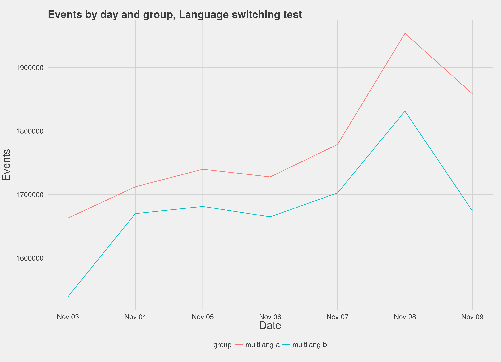
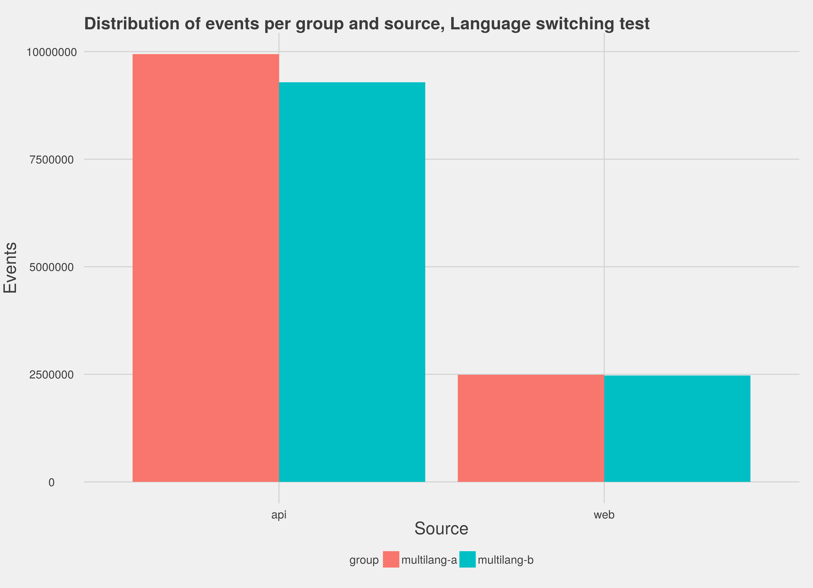

## Summary

This was an A/B test to determine the impact of switching search languages in the case that a query produces zero results. Our hope was that applying language detection methods to failed queries would let us, for a subset, identify that they were using the wrong language, switch them over to the correct one, and get them results.

In practice, we found no evidence that this had a substantial impact on the zero results rate. Our hypothesis is that this is due to a combination of poor language detection and the small scale of queries that produced zero results and were not in the language of the project they were made on.

## Background

One of the core goals of the Discovery team is to improve the Zero Results Rate - the proportion of user searches that return no results. After examining failed queries we noticed that some queries were perfectly valid, but simply in the wrong language; accordingly, we concluded that if we *detected* the user's language and re-ran their query, over indexes in that language, we would be able to reduce the zero results rate.

We launched a test that collected data from 4 November 2015 to 11 November 2015, running over 1 in 10 queries. Half of the search queries (the control group -- variation "A") were given the *status quo* ; half (the test group -- variation "B") would have language detection methods and a second search query if their query produced 0 results. Over a week of testing this produced 25,348,283 events.

## Exploratory Analysis

Our first task is to explore the data to make sure, amongst other things, that sampling worked correctly. If it did not, the test group may not be comparable with the non-test group.

First, we looked at things on a by-day basis; for each day in the test, how many events do we have in each group?

What this shows is that sampling is indeed uneven -- the control group gets significantly more events than the test group (although both are still large enough to rely on) -- but is consistent with respect to volume of queries. That is, a rise in queries coming from the control group is in synch with a similar rise in queries coming from the test group.

Diving deeper into the data we see that the discrepancy is caused by queries from the API; queries through the web interface (which are more likely to be "user" queries) are pretty much even. Accordingly we will look at both the outcome for the test as a whole, and the outcome for just "web" queries.

## Results

We employed Bayesian methods in the analysis of the results because classical null hypothesis significance testing methodology does not work for the enormous volume of data we collected. We look at the "95% Credible Interval" for the difference in proportions between the test and control groups. That is, the difference will have 95% probability of being in the interval. We are interested in seeing whether this probable difference is big enough to be the result of a positive impact of the test rather than just random noise. To that end, what we would like to see is a range that is:

1. Above 0, indicating that the outcome was positive;
2. Far enough from 0 to indicate that the outcome was substantial.

For the overall dataset, the 95% Credible Interval is (-0.0433 -0.0427). That is, the difference is somewhere between -4.33% and -4.27%. This is not above 0, indicating that the outcome was not positive; the language test does not tend to result in an improved outcome for API and Web users.

For the queries made through the web interface, the 95% Credible Interval is (0.0027, 0.0038), or (0.26%, 0.38%) in other words. The test group was 1.003-1.004 times more likely to get some results -- a positive outcome, but not a practically significant impact. The reason for the change in direction and magnitude is that queries made through API make up such a large sub-population that the negative effect they experienced (-5.58%, -5.52%) actually overpowered the positive effect the web queries experienced.

## Conclusion

The test did not show that language switching in the case that zero results are returned produces a positive outcome for all users. This may simply be because our language detection methods are naïve - subjectively, we have seen them return unexpected and incorrect answers. It may also be that the failed queries are still not sensical even translated. This last point is especially true in the case of via-API queries where we have observed bots searching for digital object identifiers (DOIs) -- and often getting zero results -- where language switching would not help.

If we cannot enable this feature for web users only, we recommend disabling the test and not implementing this feature as the default for all users. Future work should look at the quality of language detection, or the actual queries that are being sent through language switching, in a qualitative way.
